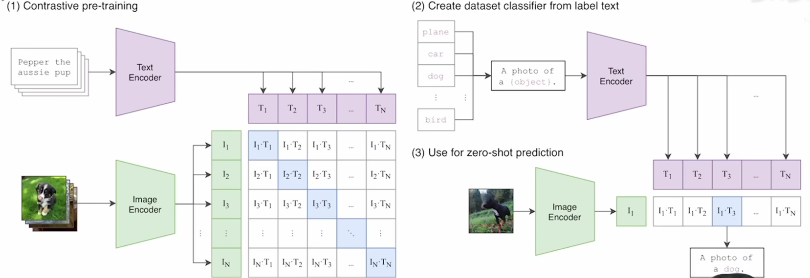

#  CLIP

> 类别：多模态学习

> 特点：
>
> * 将文本信息与图片（视频）通过正负样本训练，从而建立起图片与文本的语义信息；
>
> * 高可迁移性：在没有用其他数据集的训练数据训练的前提下，zero-shot推理能够得到很好的效果；
> * 摆脱类别限制：数据集 Image-Net有1k个类，正常推理最后的 mlp 分类头只能在这 1k 个类中做识别。CLIP 通过文本信息  “a photo of (X/Y/Z…)” 得到图片与哪个类别最接近，从而得到不在1k个类别中的类别-X/Y/Z...；

> 痛点：
>
> * 没有亿点点算力 train 不动，openai 自己训练这个模型都需要各种工程优化才能 train 起来。没有把源码开源，但把训练好的模型开源了。
> * 在细分类的数据集上，CLIP的效果低于有**监督训练 Res-Net50 这个基线**网络的；
> * 无法处理更抽象概念或更难的任务（eg.数一数图片中有**几个物体**、视频中相邻两帧是**异常**还是**非异常**…）

