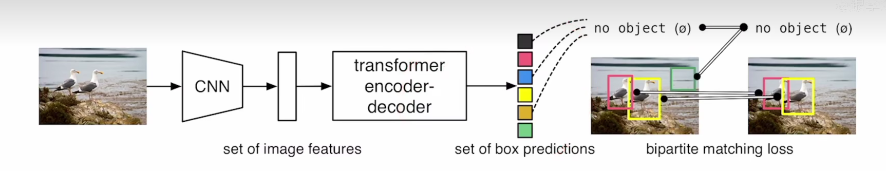

#  DETR（END-END Object Detection With Transformer）

> 亮点：
>
> * 模型足够简单（模型代码100行以内，深度学习库只要能支持 cnn，Transformer即可）
>
> * 使用端到端的训练方法，可以直接输入图片，不需要物体探测的先验（如 nms：non-maximum suppression）知识和特殊算子
> * 最终的预测框是并行预测的（in parallel），自然语言处理的Transformer最后的 Decoder 部分是有掩码机制，是单个单个word预测。

> 痛点：
>
> * 训练时间长
> * 用了 Transformer，所以不太好优化
> * 性能跟 物体检测 最好的 SOTA 比还是差了点，尤其是小物体的检测

##  模型梗概

> 训练：
>
> 1. 先利用 CNN 抽取图片特征
> 2. 将抽取的特征拉直，通过 Transformer Encoder 学全局特征
> 3. 利用 Transformer Decoder 生成全局预测框集合
> 4. 将生成的预测框集合与 ground truth 的框进行匹配，在匹配到的框里面算 ground truth 的 loss，没有匹配到的框被标记为 “no object”

> 推理：
>
> 与训练步骤的前三步一样，在第四步是利用生成的预测框集合用一个阈值去卡一下输出的置信度，置信度 > 0.7 的预测会被保留即为前景物体。

##  数据集

目标检测数据集：COCO