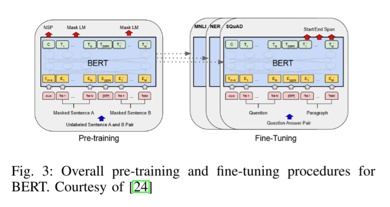
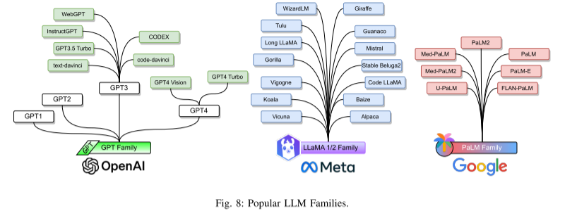
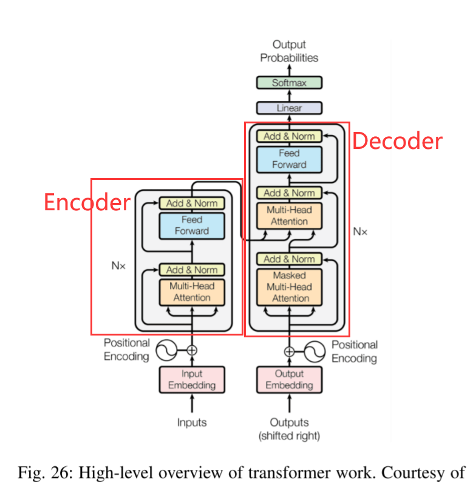
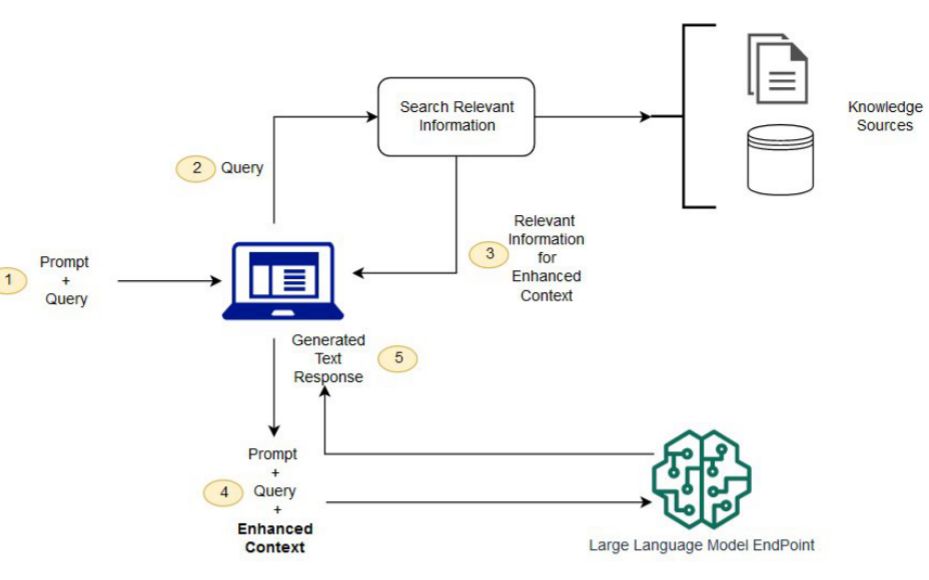
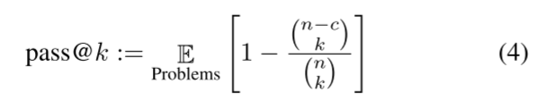

#  [Large Language Models：A Survey](https://arxiv.org/pdf/2402.06196)

论文整体架构为以下五方面：

1. 讨论突出的LLMs（eg.GPT，LLamA、PaLM）的特点、贡献、局限；
2. 概述构建和增强LLMs的相关技术；
3. 调查在训练LLMs和微调（fine-tuning）时受欢迎的数据集；
4. 介绍LLMs的评估指标；
5. 最后讨论开放的挑战和未来研究方向；

> Key Word：

##  1.主流LLMs

###  1.1Bert

**Bert**属于 Coder-Only 模型，有三个模块构成：（1）嵌入模块`an
embedding module that converts input text into a sequence
of embedding vectors`；（2）Transformer 编码块`a stack of Transformer encoders that converts embedding vectors into contextual representation vectors`；（3）分类器模块，将输出层的表示向量转换为 One-hot编码`a fully connected layer that converts the representation vectors (at the final layer) to one-hot vectors`.

预训练的 Bert 模型可以添加对应的分类器层进行微调来适应不同的语言理解任务。

> Bert 变体：
>
> * **RoBERTa**：使用一组模型设计选择和训练策略（model design choices and training strategies），例如：修改一些关键的超参数，删除下一个句子的预训练目标以及使用更大的 mini-batches 和 learning rates
> * **ALBERT**：使用两种参数约简技术来降低内存消耗并提高 BERT的训练速度-（1）将嵌入矩阵拆分为两个较小的矩阵；（2）在 groups 中使用 repeating layers 来拆分
> * **DeBERTa**：使用两种新技术改进了 BERT 和 RoBERTa 模型-（1）disentangled attention mechanism：每个单词分别使用两个向量来表示，分别编码其内容和位置，以及单词之间的注意权重分别使用解纠缠矩阵 disentangled matrices 对其内容和相对位置进行计算（2）使用增强的掩码解码器在解码层中合并绝对位置，以预测模型预训练中的 masked tokens。

###  1.2GPT1&GPT2

**GPT1&GPT2**是最广泛使用的两个纯解码器预训练语言模型（decoder-only PLMs）。

GPT-1 首次证明，在各种未标记文本语料库上，以**自监督**学习方式（即 next world/token prediction），仅使用解码器转换器模型的生成式预训练(GPT)可以在广泛的自然语言任务上获得良好的性能。

GPT-2 表明，在由数百万个网页组成的大型 WebText 数据集上训练时，语言模型能够在没有任何明确监督的情况下学习执行特定的自然语言任务。GPT-2 模型遵循 GPT-1 的模型设计，并进行了一些修改：将层归一化移动到
每个子块的输入，在最终的 self-attention 块之后添加额外的层归一化，修改初始化以考虑残差路径上的积累和残差层的权重缩放，词汇量扩展到50、25，并且上下文大小从512个 token 增加到1024个 token。

##  2. Large Language Model Families

回顾三个LLM家族: GPT、LLaMA 和 PaLM。

### 2.1 The GPT Family

Generative Pre-trained Transformers (GPT)是由OpenAI开发的**仅基于解码器**的转换器语言模型家族。

#### 2.1.1 GPT-3

GPT-3 是一个预训练的自回归语言模型，具有1750亿个参数。GPT-3被广泛认为是第一个 LLM，因为它不仅比以前的 plm 大得多，而且第一次展示了在以前较小的 plm 中没有观察到的应急能力。GPT-3 显示了上下文学习的紧急能力，这意味着GPT-3 可以应用于任何下游任务，而无需任何梯度更新或微调，任务和少量演示完全通过与模型的文本交互指定。

####  2.1.2 CODEX

CODEX 是一种通用编程模型，可以解析自然语言并生成响应代码。CODEX 是GPT-3的后代，对从 GitHub 收集的代码语料库进行了微调，支持微软的GitHub Copilot。

####  2.1.3 WebGPT

WebGPT 是 GPT-3 的另一个后代，经过微调，可以使用基于文本的网络浏览器回答开放式问题，方便用户搜索和浏览网络。具体来说，WebGPT的训练分为三个步骤。

1. WebGPT学习使用人类演示数据模拟人类浏览行
   为。
2. 学习奖励函数来预测人类的偏好。
3. 对WebGPT进行改进，通过 **reinforcement learning** 和 **rejection sampling** 来优化奖励函数。

####  2.1.4 GPT-4

GPT-4 是一个多模态LLM，可以将图像和文本作为输入，并产生文本输出。GPT-4先在大型文本语料库预训练来预测  next tokens，然后使用 **RLHF**（reinforcement learning human feedback） 进行微调，使模型行为与人类期望的行为保持一致。

###  2.2 The LLaMA Family

LLaMA家族：LLaMA 是一个基础语言模型的集合，由 Meta 发布。与GPT 模型不同，LLaMA 模型是开源的。

第一套 LLaMA 模型于2023年2月发布，参数范围从 7B 到 65B。LLaMA使用GPT-3的 transformer 架构，并对架构进行了一些小的修改，包括:

(1) 使用SwiGLU激活函数代替ReLU;

(2) 使用 rotary positional embeddings 代替 absolute positional embedding;

(3) 使用 root-mean-squared layer-normalization 代替 standard layer-normalization

开源的 LLaMA-13B 模型在大多数基准测试中优于专有的 GPT-3(175B) 模型，使其成为LLM研究的良好基准。

##  3. How LLMs Are Built

一旦选择了模型架构，训练LLM所涉及的主要步骤包括:

1. 数据准备(收集、清理、删除等)
2. 标记化(tokenization)
3. 模型预训练(以自监督学习的方式)
4. 指令调优和对齐(instructiontuning, and alignment)

###  3.1 占主导地位的LLM架构

目前使用最广泛的LLM架构有 **encoder-only, decoder-only, and encoder-decoder**。其中大部分都是基于 Transformer (作为构建块)。

Transformer 框架，该框架最初是为使用 gpu 进行有效的并行计算而设计的。Transformer 的核心是(自)注意机制，它可以使用 gpu 比递归和卷积机制更有效地捕获长期上下文信息。

Transformer 语言模型架构最初是为机器翻译而提出的，它由一个编码器和一个解码器组成。编码器由 `N = 6` 个相同的 Transformer 层堆叠而成。每一层都有两个子层。第一层是多头自关注层，另一层是简单的位置智能全连接前馈网络。解码器由6个相同的层堆叠而成。除了每个编码器层中的两个子层外，解码器还有第三个子层，该子层对编码器堆栈的输出执行多头关注。

####  3.1 Encoder-Only

对于这个家族，在每个阶段，注意层都可以访问初始句子中的所有单词。这些模型的预训练通常包括以某种方式破坏给定的句子(例如，通过屏蔽其中的随机单词)，并将寻找或重建初始句子的任务分配给模型。编码器模型非常适合需要理解完整序列的任务，例如句子分类（sentence classification）、命名实体识别（named entity recognition）和抽取式问答（extractive question answering）。一个突出的仅限编码器的模型 BERT(双向编码器表示)。

#### 3.2 Decoder-Only

对于这些模型，在每个阶段，对于任何单词，注意层**只能访问句子中在其之前定位的单词**。这些模型有时也被称为自回归模型（auto-regressive models）。这些模型的预训练通常被表述为预测序列中的下一个单词(或token)。只有解码器的模型最适合涉及文本生成的任务。GPT模型是这类模型的突出例子。

####  3.3 Encoder-Decoder

这些模型同时使用编码器和解码器，有时被称为**序列到序列模型**。在每个阶段，编码器的注意层可以访问初始句子中的所有单词，而**解码器的注意层只**
**访问输入中位于给定单词之前的单词**。这些模型通常使用编码器或解码器模型的目标进行预训练，但通常涉及一些更复杂的东西。例如，一些模型是通过用单个掩码特殊词替换文本的随机跨度(可以包含几个词)来进行预训练的，然后目标是预测这个掩码词所替换的文本。编码器-解码器模型最适合基于给定输入生成新句子的任务，例如摘要、翻译或生成式问答。

###  3.2 数据清洗

数据质量对于在其上训练的语言模型的性能至关重要。数据清洗技术，如**过滤、重复数据删除**，对模型的性能有很大的影响。

> **数据过滤**：数据过滤的目的是提高训练数据的质量和训练出来的LLMs的有效性。常见的数据过滤技术包括：
>
> 1）**去除噪声**：指去除可能影响模型良好泛化能力的不相关或有噪声的数据。例如，可以考虑从训练数据中去除错误信息，以降低模型产生错误响应的机会。质量过滤的两种主流方法包括：**基于分类器**的和**基于启发式**的框架。
>
> 2）处理异常值(Outliers)：识别和处理数据中的异常值或异常，以防止它们不成比例地影响模型。
>
> 3）解决不平衡：平衡数据集中类或类别的分布，以避免偏差并确保公平代表。这对于 responsible model 训练和评估特别有用。
>
> 4）文本预处理：通过删除停止词、标点符号或其他可能对模型学习没有显著贡献的元素来清洗和标准化文本数据。
>
> 5）处理歧义：解决或排除可能在训练过程中混淆模型的非模糊或矛盾数据。这可以帮助模型提供更明确、更可靠的答案。

> **重复数据删除**：重复数据删除是指删除数据集中重复的实例或重复出现的相同数据的过程。重复的数据点可能会在模型训练过程中引入偏差，并减少多样性，因为模型可能会多次从相同的示例中学习，这可能会导致对那些特定实例的过拟合。

### 3.3 Tokenizations

Tokenizations 是指将文本序列转换成较小部分的过程，称为 tokens。Tokenizations 工具只是简单地根据空白将文本切成标记，但大多数 Tokenizations 工具都依赖于字典。然而，在这种情况下，字典外的单词 (out-of-vocabulary) 是一个问题。为了增加字典的覆盖率，llm 常用的分词器是基于**词根**的，词根可以组合成大量的词，包括训练数据中未见的词或不同语言中的词。

> 三种流行的分词器：
>
> 1. **BytePairEncoding**：最初是一种数据压缩算法，它使用字节级的频繁模式来压缩数据。从定义上看，该算法主要是尽量保持频繁词的原始形式，并对不常见的词进行分解。
> 2. **WordPieceEncoding**：该算法主要用于 BERT 和 Electra 等模型。在训练开始时，算法从训练数据中取出所有的字母，以确保训练数据集中不会留下任何作为UNK或未知的东西。与BytePairEncoding 类似，它尝试根据频率将所有标记放入词汇表的可能性最大化。
> 3. **sentencepeceencoding**：尽管前面描述的两种标记器都很强大，但它们仍然假设单词总是由空白分隔。事实上，在一些语言中，单词可能会被许多嘈杂的元素所破坏，比如不需要的空格，甚至是虚构的单词。sentencepeceencoding 试图解决这个问题。

### 3.3 位置编码-Positional Encoding

1. 绝对位置嵌入(Absolute Positional Embeddings)
2. 相对位置嵌入(Relative Positional Embeddings)
3. 旋转位置嵌入(Rotary Position Embeddings)
4. 相对位置偏差(Relative Positional Bias)

###  3.4 模型预训练-Model Pre-training

在预训练期间， LLM 在大量(通常)未标记的文本上进行训练，通常以**自监督**的方式进行。最常见的两种预训练方法包括**下一个 token 预测**(自回归语言建模)和**掩码(maked)语言建模预测被遮盖部分**。

### 3.5 Fine-tuning and Instruction Tuning

早期的语言模型，如使用自我监督训练的BERT，不能执行特定的任务。为了使基础模型有用，它需要对带有标记数据的特定任务进行微调。

###  3.6 对齐-Alignment

AI对齐是将AI系统转向人类目标、偏好和原则的过程。LLMs，预先训练单词预测，经常表现出意想不到的行为。例如，它们可能生成有毒、有害、误导和有偏见的内容。重要的是要包括进一步的步骤来改善模型的一致性并避免意外行为。

RLHF (基于人类反馈的强化学习)和 RLAIF (基于 AI 反馈的强化学习)是两种流行的方法。RLHF 使用奖励模型从人类反馈中学习对齐。这个奖励模型经过调整后，能够对不同的输出进行评级，并根据人类给出的它们的对齐偏好进行评分。奖励模型向原始 LLM 提供反馈，该反馈用于进一步调整 LLM。另一方面，来自 AI 反馈的强化学习直接将预训练的和对齐良好的模型连接到 LLM，并帮助它从更大、更对齐的模型中学习。

###  3.7 解码策略-Decoding Strategies

##  4.

### 4. retrieval augmented generation (RAG)

预训练的 LLMs 的主要限制之一是他们缺乏最新的知识或访问私人或用例特定的信息。RAG 包括从输入提示提取查询，并使用该查询从外部知识来源(例如搜索引擎或知识图，检索相关信息。然后将相关信息添加到原始提示中，并馈送给LLM，以便模型生成最终响应。RAG系统包括三个重要组成部分:检索、生成、增强。

###  4.2 LLM Agents

Agents 指的是基于(增强的) LLM 的专门实例的系统，该系统能够自主执行特定的任务。这些代理被设计为与用户和环境进行交互，以根据输入和交互的预期目标做出决策。代理是基于 llm 的能够访问和使用工具，并根据给定的输入做出决策。它们被设计用来处理需要一定程度的自主权和决策权的任务，通常超出了简单的响应生成。

##  5. LLMS的流行数据集

###  5.1 基本任务的数据集:语言建模/理解/生成

**Natural Questions** 是一个QA数据集，由真实匿名的、聚合的查询组成，这些查询作为问题提交给谷歌搜索引擎。注释者会看到一个问题以及前5个搜索结
果中的维基百科页面，并注释一个长答案(通常是一个段落)和一个短答案(一个或多个实体)，如果页面上存在，或者如果没有长/短答案，则标记为null。

**MMLU** 旨在评估在 zero-shot 和 few-shot 情况下获得的知识优势。这意味着MMLU评估模型的一般知识和解决问题的能力。它涵盖了STEM、人文、社会科学和其他领域的57个学科。基准的复杂程度各不相同，从初级到高级专业。值得一提的是，这个数据集的主要贡献是用于多任务语言理解、问题回答和算术推理。

**MBPP** 代表 “most Basic Python Prob-lems”，为**评估代码生成设计的模型**的性能提供了一个基准。该基准包含974个简短的 Python 程序，其中包括广泛的主题，包括基本的编程概念和标准的 li- library 用法，等等。每个挑战包括一个任务描述、代码解决方案和三个自动化测试用例。

**HumanEval** 是一个用于代码生成任务的数据集。该数据集由164个手工制作的编程挑战组成。每个挑战都伴随着一个函数签名、文档字符串、代码体和多个单元测试。开发这个数据集背后的主要直觉是保证其内容不受代码生成模型的训练数据集的影响。

**APPS** 专为 Python 编程语言的代码生成任务而设计。APPS 数据集包含232,444个 Python 程序的集合。数据集中的每个程序平均有18行 Python 代码。此外，APPS 提供了访问10000个独特编程练习的存储库，每个练习都有基于文本的问题描述。最后要强调的一点是，**它包含了测试用例**。

**WikiSQL** 是为代码生成任务精心制作的，它有87,726对精心标记的SQL查询和相应的来自维基百科表的自然语言问题。SQL查询包含三个子集: test sets (17,284个示例)、development (9,145个示例)和 training (61,297个示例)。

**TriviaQA**是为QA任务设计的。该数据集包含超过650,000个问答证据三元组。该数据集中有95000个问答对，每个都由琐事爱好者撰写，并由平均6个独立来源的证据文件支持。这些文档自动从维基百科或更广泛的网络搜索结果中获取。数据集分为两部分，包括来自维基百科和网络域的真实答案，验证集包含准确回答的问题以及来自维基百科和在线的相关文档。

**RACE** **适合阅读理解任务**。该数据集基于12至18岁的中国中学生和高中生完成的**英语测试**，它包含大约28,000个文本和100,000个由人类专家(主要是英语教师)严
格准备的问题。该数据集包含了广泛的主题，这些主题是有目的地选择的，用于评估学生的理解和推理能力。该数据集分为三个子组:RACE-M、RACE-H和RACE。RACE-M指的是初中考试，而RACE-H指的是高中考试。最后，RACE是RACE-M和RACE-H的合成。

**SQuAD** 代表“斯坦福问答数据集”(Stanford Question - answer Dataset)，是基于维基百科文章的众包阅读理解数据集。它有大约10万个问答对，连接到500多篇文章。这些问题的答案通常是取自相应阅读段落的文本片段或跨度。在某些情况下，这些问题可能无法回答。数据集分为三组:80%的训练集、10%的开发集和10%
的隐藏测试集。

**BoolQ** 是一个 yes/no 问答数据集，目标是阅读理解任务。BoolQ包含15,942个示例。每个例子都是一个三元组，包括一个问题、一个相关段落和答案。虽然这个数据集背后的主要直觉是用于阅读理解，但它可以用于推理、自然语言推理和问答任务。

**MultiRC** 是另一个适合阅读理解任务的数据集。MultiRC包含简短的段落以及可以使用段落中的信息回答的多句问题。该数据集中的段落来自各种来源，包括新闻、小说、历史文本、维基百科文章、关于社会和法律的讨论、小学科学教科书和9/11报告。每个问题都有许多回答选项，**其中一个或多个选项是正确的**。回答这些问题需要跨几个句子进行推理。MultiRC数据集包括从800多个段落中收集的大约6000个多句子问题。平均而言，每个问题在总共5个选项中提供了大约2个有效答案。

###  5.2 紧急数据集:ICL，推理(CoT)，指令遵循(instructionfollowing)

评估 LLMs 应急能力的基准和数据集。

**GSM8K** 旨在**评估模型的多步数学推理能力**。GSM8K包含8.5万个由人类编写的语言多样的小学数学单词问题。数据集被分成两组:一个训练集有7.5K个问题，一个测试集有1K个问题。这些问题需要2到8个步骤才能解决。解法主要是使用基本的算
术运算进行一系列的初等计算。

**MATH** 能够评估模型解决数学问题的能力。MATH数据集有12,500个来自高中数学竞赛的问题。数据集中的每个问题都有一个循序渐进的解决方案，并在一个方框中附上了最终答案。这些问题涵盖了广泛的主题，并且具有不同的复杂程度。总共有7个科目。此外，每个问题的难度都是根据AoPS标准进行评分的，等级从1到5。“1”表示一个科目中最简单的问题，而“5”表示最难的问题。在格式方面，所有的问题和解决方案都是使用LATEX和渐近线矢量图形语言来呈现的。

**HellaSwag** 旨在评估 LLMs 的常识推理。该基准包括7万个选择题。每个问题都来自两个领域中的一个: ActivityNet 或 WikiHow，并针对以下情况可能发生的情况提供四个答案选择。正确的答案提供了一个描述情境的实际陈述即将发生的事件，但三个错误的答案是为了迷惑机器。

**AI2 Reasoning Challenge (ARC)** 用于常识性推理。该基准包括通过7,787个科学考试问题。这些问题都是英文的，大多数都是选择题。这些问题被分为两组:包含2590个难题的挑战集和包含5197个问题的简单集。每个集合也被预先划分为训练、开发和测试子集。

**PIQA** 旨在**评估基于物理常识知识**的语言表示。在这个数据集中，重点是日常情况，偏爱不常见的解决方案。中心任务是回答多项选择题，其中提供一个问题(q)以及两个可能的解决方案(s1, s2)。然后，由模型还是人来选择最佳解决方案。对于每个问题，只有一个解决方案是正确答案。

**SIQA** 为评估模型对社会情境进行常识性推理的能力提供了一个框架。SIQA数据集有38,000个选择题，旨在**评估日常环境中的情绪和社交智力**。该数据集涵盖了各种各样的社交场景。在SIQA中，潜在的答案是人类选择的答案和经过对抗过程过滤的机器生成的答案的混合。

**OpenBookQA** (OBQA) 是一种新型的问答数据集，其中回答其问题需要额外的书中未包含的常见和常识性知识和丰富的文本理解。该数据集包括大约6000个选择题。每个问题都与一个核心事实相关联，以及6000多个事实的附加集合。这些问题是使用多阶段众包和专家过滤程序开发的。OpenBookQA问题很难，因为它们**需要在有限的背景下进行多跳推理**。

**TruthfulQA** 是专门为评估生成问题答案的语言模型的真实性而设计的。该数据集包括817个问题，由作者编写，来自38个不同的类别，包括健康、法律、金融和政治。这些问题是有目的地设计来挑战人类应答者的，因为它们可能包含导致错误答案的常见误解。

**OPT-IML Bench**是教学元学习的综合基准。它涵盖了来自8个现有基准的2000个NLP任务。OPT-IML Bench由一个包含17.9 M个样本的训练集、一个包含145K个样本的开发集和一个包含321K个样本的测试集组成。

###  5.3 增强数据集:使用外部知识/工具

介绍为增强 LLMs 能力而设计的数据集。

**HotpotQA** 旨在涵盖多样化且可解释的问答数据集，该数据集需要多跳推理。这个数据集来源于英文维基百科。它由大约11.3万个问题组成。数据集中的每个问题都有两个段落，称为黄金段落，来自两篇维基百科文章。此外，在这些段落中还有一个句子列表，这些句子是众包工作者挑选出来的，对回答这个问题同样重要。

**ToolQA** 是一个问答基准，用于评估 LLMs **使用外部工具回答问题**的能力。

**GPT4Tools **作为教学数据集，由指导高级教师(如 Chat-GPT )生成，并以视觉内容和工具描述为条件。这个过程会产生与工具使用相关的指令。这个数据集有三个版本。第一个版本包含71,000个指令跟随数据点，用于微调GPT4Tools模型。下一个版本由用于验证的手动清理指令数据组成，涵盖了与第一个版本的工具相关的指令。最后一个版本是用于测试的清理指令数据，包括与第一个版本中不存在的
一些工具相关的指令。

##  6. 在基准测试中突出llms的性能

###  6.1 评估法学硕士的流行指标

评估生成语言模型的性能取决于它们将要用于的底层任务。

那些主要是关于从给定的选项中选择一个选项的任务(比如情感分析)，可以被看作是**简单的分类**，它们的性能可以使用分类指标来评估。**准确度 accuracy 、精密度 precision、召回率 recall、F1**等指标都适用于这种情况。同样需要注意的是，模型生成的针对特定任务(如选择题回答)的答案总是要么为 True，要么为 False。如果答案不在一组选项中，它也可以被视为 False。

然而，一些纯粹是**开放式文本生成的任务**无法以与分类相同的方式进行评估。针对评估的具体目的，需要不同的指标。在开放式生成评估中，代码生成是一个非常不同的情况。生成的代码必须通过测试套件，但另一方面，了解模型是否能够生成不同的代码也很重要解决方案作为一个代码，在其中选择正确的一个的概率是多少。**Pass@k** 在这种情况下是一个非常好的指标。它的工作方式是给定一个问题，生成不同的解决方案作为代码。使用不同的功能测试来测试它们的正确性。之后，从生成的n个解中，分别有c个解是正确的。

精确匹配(**EM**)是另一个主要与(预定义)答案的精确匹配有关的度量。如果一个预测准确匹配多个期望的参考文本中的一个，它就会将其视为正确的。在某些情况下，它可以与准确性 accuracy 相同。这里M是正确答案的总数，N是问题总数。

另一方面，人体等效分数(Human equivalence score, **HEQ**)是 **F1** 分数的替代方法。HEQ-Q 代表单个问题的精度，其中如果模型的 F1 分数超过人类的平均 F1 分数，则认为答案是正确的。同样，HEQ-D 表示每个对话的精确度；当对话中的所有问题都符合 HEQ 标准时，被认为是准确的。

其他生成任务(如机器翻译)的评估基于诸如 **Rouge** 和 **BLEU** 之类的度量。当有参考文本作为基础真理(如翻译)和生成模型生成的假设(在我们的例子中是LLM)时，这些分数可以很好地工作。这些分数主要用于目标是以计算方式检测答案和基础真值的相似性的情况。在计算方式中，这意味着不会使用超过 **N-Grams** 的东西。然而，像 BERT-Score 这样的指标对于这些情况也很好。

尽管如此，即使在今天，评估纯粹生成的内容也是非常困难的，没有找到完全拟合的指标，指标要么寻找简单的特征，如 N-Gram、SkipGram 等，要么是精度和精确度未知的模型。

##  7. 挑战与未来方向

###  7.1 更小更高效的语言模型

最初有一种“越大越好”的趋势，这种趋势显然得到了回报，像GPT-4这样的更大的模型在基准测试中获得了更好的准确性和性能。然而，这些大型模型在几个维度(例如高延迟)上成本高昂且效率低下。针对所有这些问题，目前的研究趋势是提出小型语言模型( SLMs )作为 LLM 的一种经济有效的替代方案，特别是当用于可能不需要大型模型的全部通用性的特定任务时。

我们应该期待在如何训练更小、更高效的模型这一领域的许多研究工作。诸如参数**有效微调**(PEFT)、**教师/学生和其他形式的蒸馏**等技术将继续用于从较大的模型中构建较小的模型。

###  7.2 New Post-attention Architectural paradigm

Transformer 模块一直是当前大多数LLM框架中至关重要且不变的一部分，这种架构还能流行多久，以及深度学习(和NLP)领域的下一个重大架构突破将是什么，这是一个很大的问号。自2012年AlexNet以来，我们已经看到了许多架构的流行和过时，包括LSTM,GRU, seq2seq，但 Transformer 自诞生以来一直是主导的方法。如前所述，注意力是驱动变形金刚的主要机制。最近，在被称为“**post-attention**”的替代方法方面，有了一些很有前途的研究。

上下文长度越长，我们可以挤进上下文的令牌就越多。模型能接触到的信息越多，它的响应就越好。但另一方面，在非常长的语境下，模型很难记住所有的信息，并有效地处理所有的信息。**基于注意力的模型对于较长的上下文是非常低效的**，这就是为什么我们应该期待在不同的机制上进行更多的研究，这些机制可以处理较长的上下文，并且通常会提出更有效的架构。