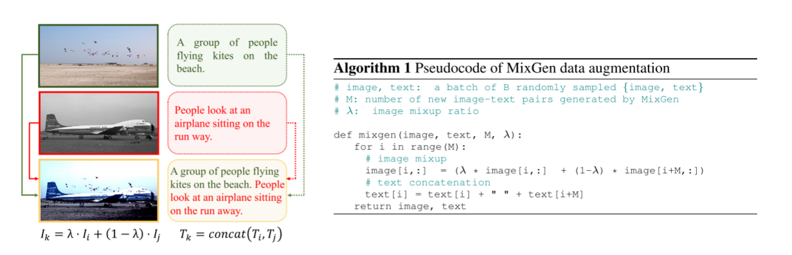

#  22.06[MixGen-A New Nulti-Modal Data Augmentation](https://arxiv.org/pdf/2206.08358v3)

##   介绍

以往的工作无论在图像还是文本模型都使用“温和无伤”的数据增强方式。对于图像：ViLT使用数据增强方法 RandAugment （不包含颜色变换）、CLIP 和 ALIGN 只使用随机裁剪而不包含其他的数据增强的方法；对于文本：一般只进行 ”masked“掩码操作。

本文介绍一种能轻易地适用于各种 Vision-Language 方法和任务同时不丢失语义信息的”**即插即用**“的数据增强方法。

##  概览

对一个随机采样的大小为 B 的 minibitch 文本对中，对前 m 个文本对操作，将前 m 个文本对与接着的 m 个文本对进行“融合”（默认 $\lambda=0.5 \quad M=\frac{B}{4}$）。

在图像原始像素之间进行简单的**线性插值**，两者文本直接拼接，将前 m 个文本对替换新生成的文本对。	