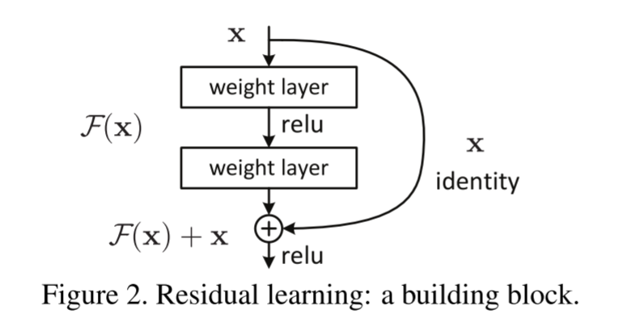
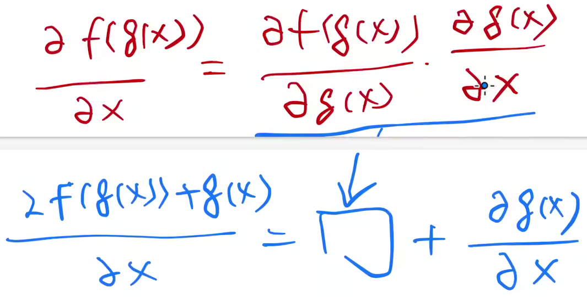

#  ResNet - Deep Residual Learning for Image Recognition

> 当在比较浅的网络上训练的效果比较好的前提之下，再加上若干层变成一个较深的网络后，理论上效果应该不会变低，那怕加上的新的层实现的作用为简单映射即：x -> x，效果也应该是保持不变的，但这个较深的网络似乎找不到这个 solution，效果会变得比原来更差。但加上残差后虽然参数没有减少，但是残差块的引入使得模型内部的复杂度降低了，会使得引入残差块的深度网络更容易地学习出较为简单的模型来拟合数据，进而减少过拟合。
>
> 同时，训练更深更大的网络可能会出现梯度爆炸和梯度消失等问题，由于梯度大小一般是在 0 附近，随着深度加深，根据链式求导，梯度会越来越小。但残差加上了输入，加上对输入求导的梯度能够使随着层数加深，梯度的大小规模能够保持不变，从而能够训练的更久，train的更久。

