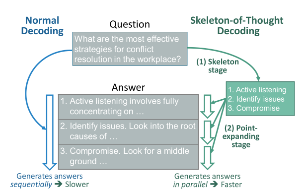
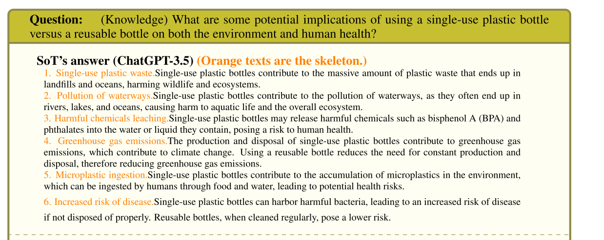
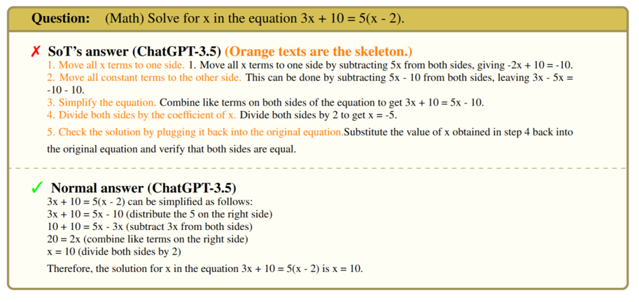
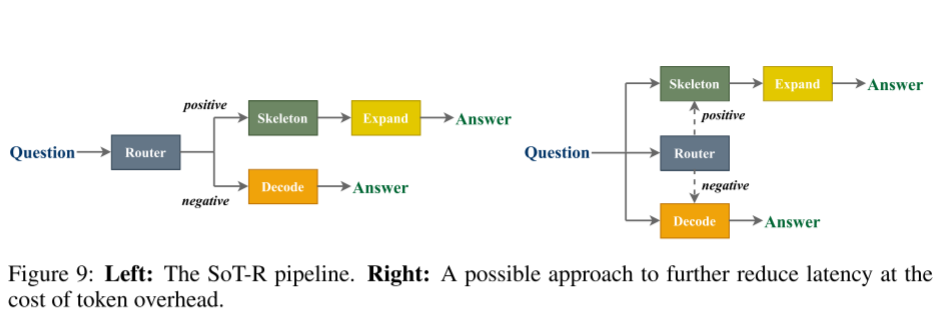
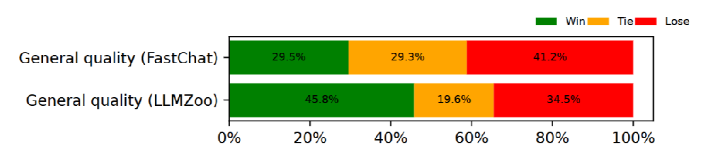
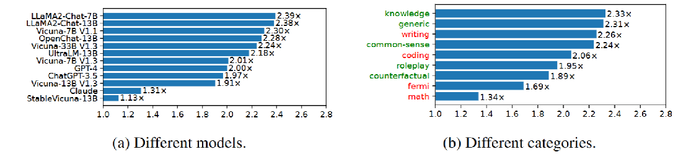

#  [[2023-ICLR-SoT]SKELETON-OF-THOUGHT: PROMPTING LLMS FOREFFICIENT PARALLEL GENERATION](https://arxiv.org/pdf/2307.15337)

##  问题

高延迟：当前的LLMs采用顺序解码方法，导致生成延迟高，影响用户体验。

**解决方案：**骨架思维（Skeleton-of-Thought, SoT）

> 动机：受到人类思考和写作过程的启发，SoT方法首先生成答案的骨架，然后并行生成每个骨架点的内容。
>
> 步骤：
>
> * 生成骨架：使用LLM生成答案的骨架，即一个简短的提纲。
> * 并行生成：对每个骨架点进行并行API调用或批量解码，生成详细内容。

（1）生成骨架阶段

> - 使用特定的提示（prompt）引导LLMs生成答案的骨架。   
> - 骨架通常是一个简短的提纲，列出答案的主要点。

（2）并行生成阶段

> - 基于生成的骨架，通过并行API调用或批处理解码完成每个骨架点的内容。   
> -  并行生成显著提高了生成速度。

##  适用/不适用情况

适合情况：Counterfactual, knowledge, common sense, generic.

> 这些类别的特征为：理想的答案应该包括几个相对独立的点。
>
> (Counterfactual) What if the Internet had been invented during the Renaissance period? – 如果互联网是在文艺复兴时期发明的呢？
>
> (Common sense) How can you determine if a person is genuinely interested in a conver-
> sation or simply being polite? – 你如何判断一个人是真的对谈话感兴趣，还是只是出于礼貌？

---

不适合情况：Math，Fermi。

> 这些问题的特征为：这步需要上步结果/假设。
>
> (Fermi) How many times has the Earth orbited the Sun since the beginning of life? – 自从生命开始以来，地球绕太阳运行了多少次？
>
> (Math) Solve for x in the equation 3x + 10 = 5(x - 2).

SOT（骨架思维）局限性：

> 适合：推理需要长答案且结构可以提前规划的问题不适合：需要逐步推理或只需要短答案的问题还有需要逻辑推理的问题。

解决方法：设计一个路由器（选择器），对输入问题进行一个评判：

> 训练好的路由器（Trained Router）
>
> * 实现：将路由问题视为一个序列分类任务，使用RoBERTa模型进行微调。
> * 数据：微调数据来自LIMA训练集，包含1,030个Q&A对，来源包括Stack Exchange、wikiHow和Pushshift Reddit。
> * 标注过程：标注每个问题是否适合使用SoT（标签1）或不适合（标签0）。

左图通过路由器Router评判，如果不适合使用SOT的问题（如假设问题、数学问题等）则使用正常解码去解答。

右图是一种极致降低延迟的方法，同时运行路由器、正常生成和 SOT 生成，一旦路由器做出决定，则终止其中一个不适合的生成。但这样会消耗更多的 Token。

##  效果

**生成质量**：

使用Fastchat、LLMZoo基于大模型评估框架进行测评，下图为使用FastChat和LLMZoo的“通用”指标，SoT与正常生成的胜/负率。

**生成速度：**

不同模型和问题类别下SoT的平均速度。

