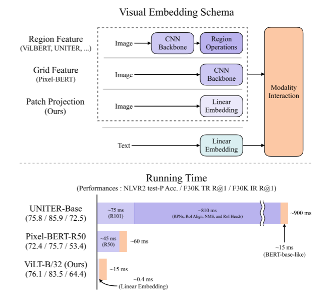
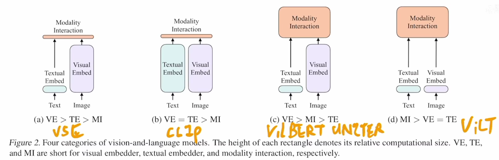
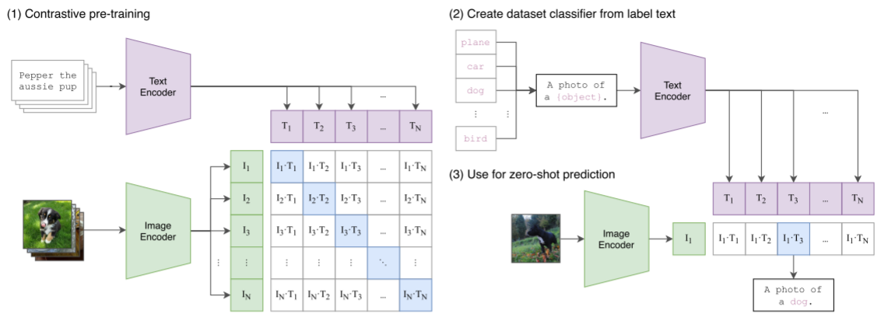
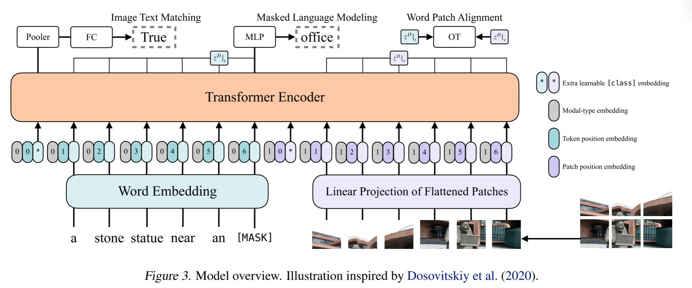

#  [ViLT: Vision-and-Language Transformer Without Convolution or Region Supervision](http://arxiv.org/pdf/2102.03334)

> 简介：第一个摆脱了目标检测的视觉文本模型
>
> 类别：多模态学习

算力：64张32GV100 训练三天

ViLT是受ViT的启发，利用图片的特征提取方式，是ViT手快地在多模态的应用

##  摘要/介绍

随着 Transformer 框架在 nlp 领域和 cv 领域表现良好，紧接着就有人将图像和文本处理结合起来即 Vision-and-Language Pre-training (VLP)，其中 [CLIP](https://openai.com/blog/clip/) 作为最知名的VLP 模型之一，有很好的迁移学习能力。

上图可以看出，其他的 VLP 采用的框架/方法都较依赖图像特征抽取的过程，大多数图像特征提取过程涉及 Region Supervision（例如，对象检测）来提取区域特征 Region Feature 或卷积体系结构（例如，ResNet）的网络。而对文本的处理只是一个简单的 Linear Embedding 进行编码，导致模型对图像特征抽取时占据了大量的训练时间。

> 生成 Region Feature 的一般流程：
>
> 1. 首先，region proposal network（RPN）基于从 CNN 主干网络得到的网格特征中提出感兴趣区域（regions of interest. RoI）。
> 2. 使用非最大抑制（Non-maximum suppression. NMS）则将 ROI 的数量减少到几千个。
> 3. 在通过诸如 RoI Align，RoI 经过 RoI heads 从而生成区域特征。NMS再次应用于每个类，最终将特征数量减少到100以下。
>
> > Backbone：ResNet-101和 ResNext-152 是两个常用的主干。

ViLT 切入点是摒弃 CNN 而使用 ViT 中的图像特征提取方式，即使用 Linear Enbedding 来抽取图像特征，可以从上图看出 ViLT 的在图像处理方面的速度大大提升。

##  BackGround

visual semantic embedding (VSE) 模型，如 VSE++，SCAN属于（a）类型。图像的 embedder 比 text 的要更加大，同时模型融合部分（Modality Interaction）又非常简单比如只使用简单的点积来作为 text 和 image 的相似程度，没法在 text 和 image 之间学习更多的关系。

[CLIP](https://openai.com/blog/clip/) 是（b）的代表，它的 text embedder 是一个 Transformer， image embedder 是 ResNet，网	络结构都非常大，但模型融合部分却非常简单，只是一个简单的点积来计算相似，没办法更好地从文本与抽取的图像特征之间学习到更为复杂的东西。

> 
>
> [CLIP](https://openai.com/blog/clip/) 的 Image Encoder 采用的是 ResNet-50；Text Encoder 采用的是一个 Transformer。

（c）与具有浅交互的模型不同，较新的VLP模型使用深Transformer来模拟图像和文本特征的交互。然而，除了交互模块之外，卷积网络仍然参与提取和嵌入图像特征，这占了图1所示的大部分计算。

（d）就是 ViLT，图像和文本都使用了简单的 Linear Embedding 进行向量嵌入，但在模型融合的时候使用了 Transformer 来学习文本和图像之间的关系。

##  Train

通过分别训练 image text matching (ITM) 和 masked language modeling (MLM) 来预训练 ViLT。

**损失函数**：Image-Text Matching Loss + Mask Language Modeling Loss

###  ITM Loss

ITM（Image Text Matching）的损失计算主要包括两个部分：**ITM Loss** 和 **Word Patch Alignment (WPA) Loss**。

#### 1. ITM Loss

ITM 的目标是判断给定的图像和文本是否匹配：

- **数据准备**：在训练过程中，模型会随机替换图像，将原本对齐的图像替换为另一张不同的图像，替换的概率为 0.5。这样，模型需要学习区分匹配的图像-文本对和不匹配的图像-文本对。
- **特征提取**：模型会提取图像和文本的特征，并将它们通过一个池化层（pooling layer）得到池化后的特征表示 p*p*。
- **分类层**：使用一个单层的线性分类器（ITM head）将池化后的特征 p*p* 投影到一个二分类的 logits（即匹配或不匹配）。
- **损失计算**：ITM Loss 使用的是**负对数似然损失（Negative Log-Likelihood Loss, NLL Loss）**，即交叉熵损失。公式如下：

​										$\mathrm{ITM~Loss}=-\sum_iy_i\log(\hat{y}_i) $

其中，$y_i$是真实标签（1 表示匹配，0 表示不匹配），$\hat{y}_i$是模型预测的匹配概率。

#### 2. Word Patch Alignment (WPA) Loss

WPA 的目标是通过计算文本子集和图像子集之间的对齐分数，进一步增强图像和文本的对齐效果。具体步骤如下：

- **特征子集**：从图像和文本的特征表示中分别提取子集 $z^{D}|_{t}$（文本子集）和 $z^{D}|_{v}$（图像子集）。

- **对齐分数计算**：使用 **Inexact Proximal Point Method for Optimal Transports (IPOT)** 计算这两个子集之间的对齐分数。IPOT 是一种用于计算最优传输（Optimal Transport）的近似方法，能够有效地计算两个分布之间的距离。

- **Wasserstein 距离**：通过 IPOT 计算得到的近似 Wasserstein 距离，反映了文本子集和图像子集之间的对齐程度。

- **WPA Loss**：将计算得到的 Wasserstein 距离乘以一个权重（0.1），然后加到 ITM Loss 中。公式如下：

  $\mathrm{WPA~Loss}=0.1\times\text{Wasserstein Distance}$

#### 3. ITM总损失

最终的 ITM 总损失是 ITM Loss 和 WPA Loss 的和：

$\mathrm{Total~WPA~Loss} = \mathrm{WPA~Loss} + \mathrm{ITM~Loss}$

#### 超参数设置

- IPOT 的超参数设置为 β=0.5*β*=0.5 和 N=50*N*=50

#### 总结

ITM 的损失计算结合了图像-文本匹配的二分类损失（ITM Loss）和文本-图像子集对齐的 Wasserstein 距离损失（WPA Loss）。通过这种方式，模型不仅能够学习图像和文本是否匹配，还能进一步优化它们在特征空间中的对齐效果。

> **Wasserstein 距离**：衡量两个概率分布之间差异的一种度量方式。它起源于最优传输理论（Optimal Transport），表示将一个分布“搬运”成另一个分布所需的最小“工作量”。
>
> 给定两个概率分布 *P* 和 *Q*，Wasserstein 距离定义为：
>
> $W_p(P,Q)=\left(\inf_{\gamma\in\Gamma(P,Q)}\int_{\mathcal{X}\times\mathcal{Y}}d(x,y)^pd\gamma(x,y)\right)^{1/p}$
>
> 其中：
>
> - $\Gamma(P,Q)$是 *P* 和 *Q* 的所有联合分布（即传输计划）。
> - d(x,y)  是 *x* 和  *y* 之间的距离（通常使用欧几里得距离）。
> - *p* 是一个参数，通常取 *p*=1 或  *p*=2。
>
> Wasserstein 距离可以理解为将一个分布 *P* 的“质量”搬运到另一个分布 *Q* 所需的最小代价。它特别适合衡量分布之间的几何差异，尤其是在分布支撑集不重叠的情况下。
>
> 相比于 KL 散度或 JS 散度，Wasserstein 距离在优化过程中更加平滑，适合梯度下降。广泛应用于生成对抗网络（GAN）、图像处理、自然语言处理等领域，用于衡量生成分布与真实分布之间的差异。

> **IPOT 方法（Inexact Proximal Point Method for Optimal Transport）**:用于计算 Wasserstein 距离的近似算法，旨在高效地求解最优传输问题。
>
> IPOT 方法则通过 **Inexact Proximal Point Method** 来更精确地逼近 Wasserstein 距离。广泛应用于图像-文本对齐、跨模态学习、生成模型等领域，用于高效计算分布之间的对齐或相似性。

### 2. MLM Loss

- **随机掩码**：在训练过程中，输入的文本 token 会以一定的概率（通常为 15%，即 0.15）被随机掩码（masked）。掩码的方式包括：
  - 将 token 替换为特殊的 `[MASK]` 符号。
  - 随机替换为其他 token。
  - 保持不变（但模型仍需预测）。
- **掩码目标**：模型的目标是预测这些被掩码的 token 的真实标签。
- 输入文本经过模型的编码器（如 Transformer）后，每个 token 会生成一个上下文相关的特征表示
- 对于被掩码的 token，模型会提取其对应的特征表示$z_{\mathrm{masked}}^D|_t$
- MLM 头部是一个两层的多层感知机（MLP），输入是被掩码 token 的特征表示 $z_{\mathrm{masked}}^D|_t$，输出是词汇表上的 logits（即每个 token 的预测分数）。
- MLM 的损失也是 **负对数似然损失（Negative Log-Likelihood Loss, NLL Loss）**，即交叉熵损失。
  * 对每个被掩码的 token，模型输出的 logits 经过 softmax 函数转换为概率分布：$p(y_i)=\text{softmax(logits}_i)$.其中，$y_i$是词汇表中第 i 个 token 的概率。
  * 计算被掩码 token 的真实标签$y_{true}$ 与预测概率分布之间的交叉熵损失：$\mathrm{MLM~Loss}=-\sum_{i\in\mathrm{masked}}\log p(y_{\mathrm{true}}^i)$.其中，$y_{true}$ 是被掩码 token 的真实标签。

##  贡献

> * 迄今为止（指2021）最简单的做 Vision-Language 的模型，使运行时间和参数量大幅度减少
> * 减少复杂度的同时（不使用 区域特征-region Feature 和 深度卷积网络），保证性能不掉
> * 训练时使用更多的数据增强模式：文本（整个词 mask 的方式 - Whole Word Masking）；图像（使用 Rand Augment）
>
> 其实整体框架没有什么新的东西，只是把 ViT 中对图片的处理搬过来从而对多模态图片处理达到了轻量化的处理。
>
> 不过这篇论文故事讲的非常好 - “能够在性能不掉点的同时提升了运行时间”，在一些小的处理细节有新的拓展 - “使用更多的数据增强模式”。
>
> 而且 paper 的 Figures 也做的很好。

##  Future Work

1. 文本可以采用 Mask 的数据增强，图像是否也可以采用 Mask 方式，来实现图片重建？(2021相继出现的[MAE](https://arxiv.org/pdf/2111.06377.pdf)实现了图片的 Mask)
2. ViLT 在做图片的数据增强 Rand Augment 的时候，没有使用变换颜色和切除的图片增强，因为会使图片和对应文本变得不匹配。那么是否有其他的数据增强策略？

##  Next Paper

* [多模态串讲上](https://www.bilibili.com/video/BV1Vd4y1v77v?spm_id_from=333.788.videopod.sections&vd_source=e69083d39594254a5d03937264d71fad)&[多模态串讲下](https://www.bilibili.com/video/BV1fA411Z772?spm_id_from=333.788.videopod.sections&vd_source=e69083d39594254a5d03937264d71fad)
* Mixgen – 采用其他数据增强，在下游任务表现很好